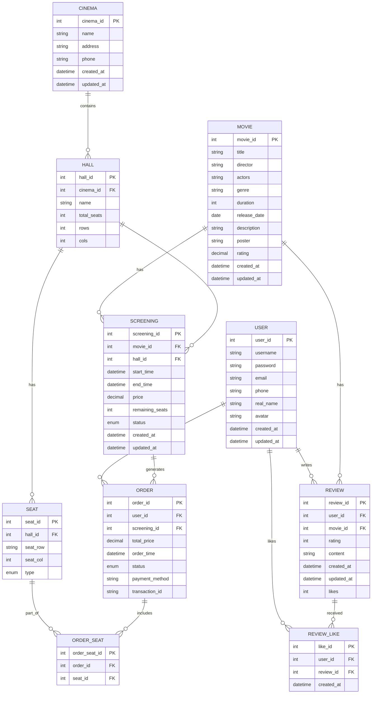

# 电影票选座与影评系统 - ER图

## 实体关系图（Mermaid格式）

## 实体关系说明

### 1. 用户（USER）
- **描述**：系统的注册用户
- **主键**：user_id
- **关系**：
  - 一个用户可以创建多个订单（一对多）
  - 一个用户可以发布多条影评（一对多）
  - 一个用户可以点赞多条影评（一对多）

### 2. 电影（MOVIE）
- **描述**：系统中展示的电影信息
- **主键**：movie_id
- **关系**：
  - 一部电影可以有多个放映场次（一对多）
  - 一部电影可以有多条影评（一对多）

### 3. 影院（CINEMA）
- **描述**：提供电影放映服务的场所
- **主键**：cinema_id
- **关系**：
  - 一个影院可以包含多个放映厅（一对多）

### 4. 放映厅（HALL）
- **描述**：影院内的具体放映场所
- **主键**：hall_id
- **外键**：cinema_id（关联影院）
- **关系**：
  - 一个放映厅可以举办多个放映场次（一对多）
  - 一个放映厅包含多个座位（一对多）

### 5. 放映场次（SCREENING）
- **描述**：电影在特定时间和地点的放映安排
- **主键**：screening_id
- **外键**：movie_id（关联电影）、hall_id（关联放映厅）
- **关系**：
  - 一个放映场次可以生成多个订单（一对多）

### 6. 座位（SEAT）
- **描述**：放映厅内的具体座位
- **主键**：seat_id
- **外键**：hall_id（关联放映厅）
- **关系**：
  - 一个座位可以被包含在多个订单座位关系中（一对多）

### 7. 订单（ORDER）
- **描述**：用户购买电影票的订单信息
- **主键**：order_id
- **外键**：user_id（关联用户）、screening_id（关联放映场次）
- **关系**：
  - 一个订单可以包含多个订单座位关系（一对多）

### 8. 订单座位（ORDER_SEAT）
- **描述**：订单与座位的多对多关系表
- **主键**：order_seat_id
- **外键**：order_id（关联订单）、seat_id（关联座位）

### 9. 影评（REVIEW）
- **描述**：用户对电影的评价
- **主键**：review_id
- **外键**：user_id（关联用户）、movie_id（关联电影）
- **关系**：
  - 一条影评可以收到多个点赞（一对多）

### 10. 影评点赞（REVIEW_LIKE）
- **描述**：用户对影评的点赞记录
- **主键**：like_id
- **外键**：user_id（关联用户）、review_id（关联影评）

## 数据库设计原则

1. **范式化设计**：遵循第三范式（3NF），确保数据的一致性和减少冗余
2. **关系完整性**：通过主键、外键和约束保证数据的完整性
3. **性能优化**：为常用查询字段创建索引，提高查询效率
4. **扩展性**：设计灵活的表结构，便于未来功能扩展
5. **安全性**：敏感数据（如密码）进行加密存储

## 索引设计

- **用户表**：username、email（用于快速查找用户）
- **电影表**：title、genre、release_date（用于电影搜索和筛选）
- **影院表**：name、address（用于影院搜索）
- **放映场次表**：movie_id、hall_id、start_time（用于快速查找放映场次）
- **订单表**：user_id、screening_id、status、order_time（用于订单查询和管理）
- **影评表**：user_id、movie_id、rating、created_at（用于影评查询和排序）

## 触发器与存储过程

- **触发器**：
  - 更新电影评分（当新增、更新或删除影评时）
  - 更新放映场次剩余座位（当创建或取消订单时）

- **存储过程**：
  - 获取可用座位（根据放映场次ID查询可用座位）
  - 创建订单（处理订单创建的完整流程）

## 视图设计

- **user_order_details**：用户订单详情视图，包含订单的完整信息
- **movie_details**：电影详情与平均评分视图，便于快速获取电影的综合信息